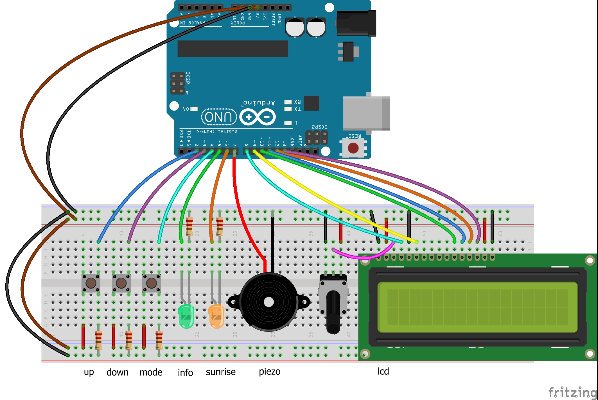

# johnnyfive-sunrisealarm

An alarm clock with sunrise simulation features to prevent [Seasonal Affective Disorder](https://en.wikipedia.org/wiki/Seasonal_affective_disorder)

Powered by an [Arduino UNO](https://store.arduino.cc/arduino-uno-rev3) and the [Johnny-Five JavaScript Robotics &amp; IOT Platform](https://github.com/rwaldron/johnny-five).

## Setup

### What equipment do I need to build this?

Just the stuff shown in the diagram above, namely:

- Arduino UNO, or another [supported device](http://johnny-five.io/platform-support/) with minor changes to the code
- LCD display with [valid controller](http://johnny-five.io/api/lcd/)
- A potentiometer to control the display contrast
- Piezo to sound the alarm
- Breadboard
- A couple of LEDs
- A few basic resistors
- Several wires
- A steady hand and a little patience

Note that the Arduino simply acts as a 'thin client'; all the actual code is executed on a host machine running Node.js (e.g. your computer). To untether, you'll need a client that can itself run Node.js. Check the [Johnny-Five platform support](http://johnny-five.io/platform-support/#relationship:embedded) page to assess your options.

### OK, I've plugged everything in, what next?

1. Prep your board using the instructions [here](https://github.com/rwaldron/johnny-five/wiki/Getting-Started)
2. Clone this repo
3. Install the necessary dependencies with `npm install`
4. Run it with `npm start`

Note: there's a decent chance you'll have to change the port at `new five.Board({ port: 'COM3' })`. Try calling it with no arguments first, but [check here](http://johnny-five.io/api/boards/) if that doesn't work.

## Operation

### Time and date

Your alarm will automatically set the time and date based on the host device (i.e. your computer). If the time and/or date is wrong, try changing it there.

### Set an alarm

When you first turn on the machine, the next alarm time will be automatically set for one hour from the current time. This can be adjusted with the buttons as follows:

| Button | Action | Alarm direction |  Minutes
| ------ | ------ | --------------- | --------
| Up | Tap | Later | 1
| Up | Hold | Later | 10
| Down | Tap | Earlier | 1
| Down | Hold | Earlier | 10

Press the mode button to set the alarm on or off. The info LED will be lit when an alarm is set, and off when it is not. Additionally, this is indicated on the display, along with the time of the upcoming alarm.

30 minutes before an alarm, the sunrise simulation will begin to get brighter. The sunlight will then fade out automatically until 30 minutes after the alarm has been dismissed.

### Dismissing an alarm

When an alarm is sounding, you can perform the following actions:

1. Tap the mode button to turn off the currently playing alarm.
2. Hold the mode button to toggle the upcoming alarm on/off.
3. Tap the up button to snooze the alarm for 1 minutes.
4. Hold the up button to snooze the alarm for 10 minutes.

#### Crafted by [Joshua Scott](mailto:jscott313@gmail.com)